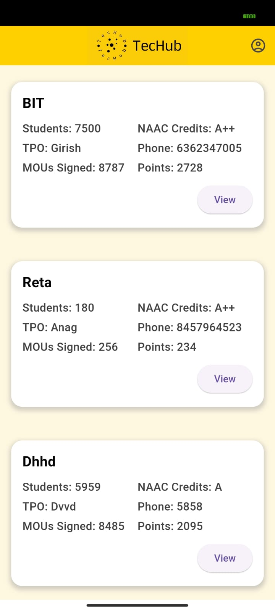
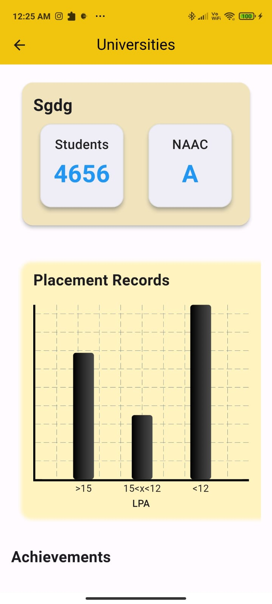
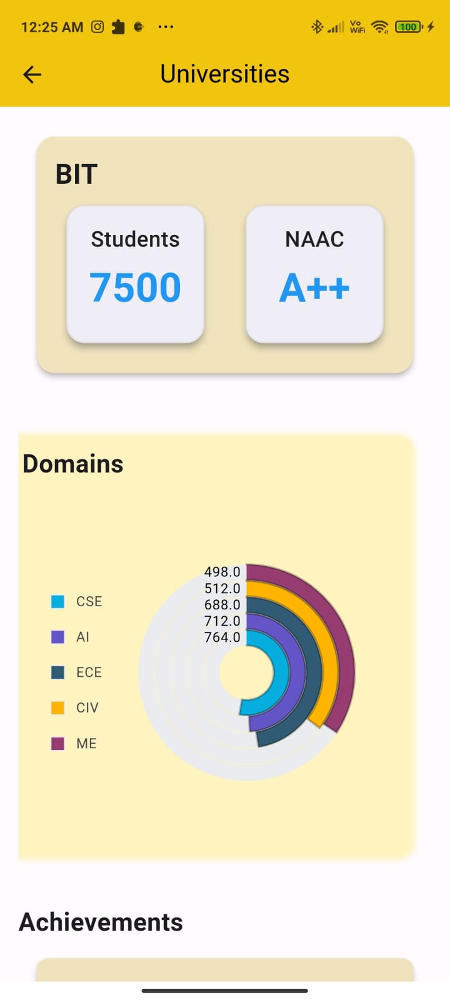
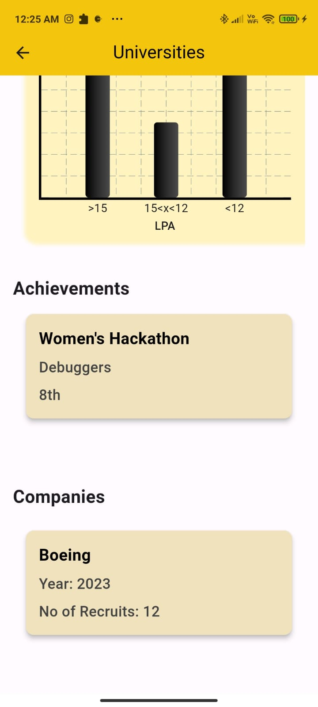

# TECHUB
A flutter application where universities can upload their achievements which will help companies to decide on campus drives and recruitment.It is connected to MySQL database through Xampp server. I have used php script to connect flutter app and database.
### Requirements for Mobile Applicaton

1. Flutter and dart installed in your system along with Android Studio
2. Dart Extension in VSCode
3. Flutter Extension in VSCode
4. Turn on the debugging mode on your mobile(preferably android device)

### Steps to run the Mobile Application
Run [*"sql"*](https://github.com/anaghahj/TechHub/blob/master/dbms_company%20(1).sql) in mysql instance from phpmyadmin with all the php files of the folder [*"db"*](https://github.com/anaghahj/TechHub/tree/master/lib/db) in folder named "dbms_company" in "C:\xampp\htdocs"

1. Run the following command in your desired folder
```sh
      flutter create appname-in-lowercase
```
2. Replace the common files provided in  [*"lib"*](https://github.com/anaghahj/TechHub/tree/master/lib)  with those present in the created folder. You have to add the folder name "assets" to your folder.
3. Set string ip to ur current ip address in [*"ip"*](https://github.com/anaghahj/TechHub/blob/master/lib/db/insertion.dart)
4. Add the dependencies:
```sh
      flutter pub get
```
5. Connect your mobile device to your created folder
6. Run the code by anyone of the following ways:
    - Run -> Run Without Debugging (or just Cntrl+F5)
    - In your terminal, under the created folder, run the following and choose your connected device. 
```sh
      flutter run
```
Here are few snapshots of the app
MAINSCREEN



DETAILS ABOUT THE UNIVERSITY

1:PLACEMENTS



2.STUDENTS PURSUING EACH DOMAIN



3.OTHER ACHIEVEMENTS AND COMPANIES THAT HAVE COME FOR CAMPUS DRIVES





